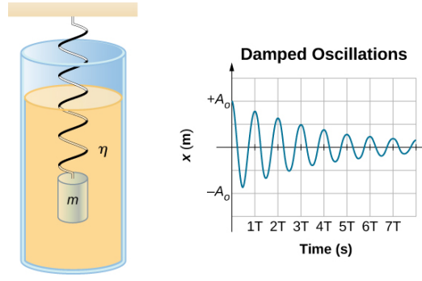

<!-- Page 1 -->

shock absorbers.

**FIGURE 15.24** To counteract dampening forces, you need to keep pumping a swing. (credit: Bob Mical)

**Figure 15.25** shows a mass $m$ attached to a spring with a force constant $k$ . The mass is raised to a position $A_0$ , the initial amplitude, and then released. The mass oscillates around the equilibrium position in a fluid with viscosity but the amplitude decreases for each oscillation. For a system that has a small amount of damping, the period and frequency are constant and are nearly the same as for SHM, but the amplitude gradually decreases as shown. This occurs because the non-conservative damping force removes energy from the system, usually in the form of thermal energy.

**FIGURE 15.25** For a mass on a spring oscillating in a viscous fluid, the period remains constant, but the amplitudes of the oscillations decrease due to the damping caused by the fluid.

Consider the forces acting on the mass. Note that the only contribution of the weight is to change the equilibrium position, as discussed earlier in the chapter. Therefore, the net force is equal to the force of the spring and the damping force ( $F_D$ ). If the magnitude of the velocity is small, meaning the mass oscillates slowly, the damping force is proportional to the velocity and acts against the direction of motion ( $F_D = -bv$ ). The net force on the mass is therefore

$$
ma = -bv - kx.
$$

Writing this as a differential equation in $x$ , we obtain

$$
m\frac{d^2x}{dt^2} + b\frac{dx}{dt} + kx = 0.
$$

To determine the solution to this equation, consider the plot of position versus time shown in **Figure 15.26**. The curve resembles a cosine curve oscillating in the envelope of an exponential function $A_0e^{-\alpha t}$ where $\alpha = \frac{b}{2m}$ . The solution is

---

<!-- Page 2 -->

740 15 • Chapter Review

# Chapter Review

## Key Terms

**amplitude (A)** maximum displacement from the equilibrium position of an object oscillating around the equilibrium position

**critically damped** condition in which the damping of an oscillator causes it to return as quickly as possible to its equilibrium position without oscillating back and forth about this position

**elastic potential energy** potential energy stored as a result of deformation of an elastic object, such as the stretching of a spring

**equilibrium position** position where the spring is neither stretched nor compressed

**force constant (k)** characteristic of a spring which is defined as the ratio of the force applied to the spring to the displacement caused by the force

**frequency (f)** number of events per unit of time

**natural angular frequency** angular frequency of a system oscillating in SHM

**oscillation** single fluctuation of a quantity, or repeated and regular fluctuations of a quantity, between two extreme values around an equilibrium or average value

**overdamped** condition in which damping of an oscillator causes it to return to equilibrium without oscillating; oscillator moves more slowly toward equilibrium than in the critically damped system

**period (T)** time taken to complete one oscillation

**periodic motion** motion that repeats itself at regular time intervals

**phase shift** angle, in radians, that is used in a cosine or sine function to shift the function left or right, used to match up the function with the initial conditions of data

**physical pendulum** any extended object that swings like a pendulum

**resonance** large amplitude oscillations in a system produced by a small amplitude driving force, which has a frequency equal to the natural frequency

**restoring force** force acting in opposition to the force caused by a deformation

**simple harmonic motion (SHM)** oscillatory motion in a system where the restoring force is proportional to the displacement, which acts in the direction opposite to the displacement

**simple harmonic oscillator** a device that oscillates in SHM where the restoring force is proportional to the displacement and acts in the direction opposite to the displacement

**simple pendulum** point mass, called a pendulum bob, attached to a near massless string

**stable equilibrium point** point where the net force on a system is zero, but a small displacement of the mass will cause a restoring force that points toward the equilibrium point

**torsional pendulum** any suspended object that oscillates by twisting its suspension

**underdamped** condition in which damping of an oscillator causes the amplitude of oscillations of a damped harmonic oscillator to decrease over time, eventually approaching zero

## Key Equations

Relationship between frequency and period

Position in SHM with $\phi = 0.00$

General position in SHM

General velocity in SHM

General acceleration in SHM

Maximum displacement (amplitude) of SHM

Maximum velocity of SHM

Maximum acceleration of SHM

Angular frequency of a mass-spring system in SHM

Period of a mass-spring system in SHM

Frequency of a mass-spring system in SHM

Energy in a mass-spring system in SHM

The velocity of the mass in a spring-mass system in SHM

$$
f = \frac{1}{T}
$$

$$
x(t) = A \cos(\omega t)
$$

$$
x(t) = A \cos(\omega t + \phi)
$$

$$
v(t) = -A \omega \sin(\omega t + \phi)
$$

$$
a(t) = -A \omega^2 \cos(\omega t + \phi)
$$

$$
x_{\text{max}} = A
$$

$$
|v_{\text{max}}| = A \omega
$$

$$
|a_{\text{max}}| = A \omega^2
$$

$$
\omega = \sqrt{\frac{k}{m}}
$$

$$
T = 2\pi \sqrt{\frac{m}{k}}
$$

$$
f = \frac{1}{2\pi} \sqrt{\frac{k}{m}}
$$

$$
E_{\text{Total}} = \frac{1}{2} k x^2 + \frac{1}{2} m v^2 = \frac{1}{2} k A^2
$$

$$
v = \pm \sqrt{\frac{k}{m} (A^2 - x^2)}
$$

Access for free at openstax.org

---

<!-- Page 3 -->

# APPENDIX A

## Units

<table>
  <thead>
    <tr>
      <th>Quantity</th>
      <th>Common Symbol</th>
      <th>Unit</th>
      <th>Unit in Terms of Base SI Units</th>
    </tr>
  </thead>
  <tbody>
    <tr>
      <td>Acceleration</td>
      <td> $\vec{a}$ </td>
      <td>m/s²</td>
      <td>m/s²</td>
    </tr>
    <tr>
      <td>Amount of substance</td>
      <td> $n$ </td>
      <td>**mole**</td>
      <td>mol</td>
    </tr>
    <tr>
      <td>Angle</td>
      <td> $\theta, \phi$ </td>
      <td>radian (rad)</td>
      <td></td>
    </tr>
    <tr>
      <td>Angular acceleration</td>
      <td> $\vec{a}$ </td>
      <td>rad/s²</td>
      <td>s⁻²</td>
    </tr>
    <tr>
      <td>Angular frequency</td>
      <td> $\omega$ </td>
      <td>rad/s</td>
      <td>s⁻¹</td>
    </tr>
    <tr>
      <td>Angular momentum</td>
      <td> $\vec{L}$ </td>
      <td>kg·m²/s</td>
      <td>kg·m²/s</td>
    </tr>
    <tr>
      <td>Angular velocity</td>
      <td> $\vec{v}$ </td>
      <td>rad/s</td>
      <td>s⁻¹</td>
    </tr>
    <tr>
      <td>Area</td>
      <td> $A$ </td>
      <td>m²</td>
      <td>m²</td>
    </tr>
    <tr>
      <td>Atomic number</td>
      <td> $Z$ </td>
      <td></td>
      <td></td>
    </tr>
    <tr>
      <td>Capacitance</td>
      <td> $C$ </td>
      <td>farad (F)</td>
      <td>A²·s/kg·m²</td>
    </tr>
    <tr>
      <td>Charge</td>
      <td> $q, Q, e$ </td>
      <td>coulomb (C)</td>
      <td>A·s</td>
    </tr>
    <tr>
      <td>Charge density:</td>
      <td></td>
      <td></td>
      <td></td>
    </tr>
    <tr>
      <td>Line</td>
      <td> $\lambda$ </td>
      <td>C/m</td>
      <td>A·s/m</td>
    </tr>
    <tr>
      <td>Surface</td>
      <td> $\sigma$ </td>
      <td>C/m²</td>
      <td>A·s/m²</td>
    </tr>
    <tr>
      <td>Volume</td>
      <td> $\rho$ </td>
      <td>C/m³</td>
      <td>A·s/m³</td>
    </tr>
    <tr>
      <td>Conductivity</td>
      <td> $\sigma$ </td>
      <td>1/Ω·m</td>
      <td>A²·s³/kg·m³</td>
    </tr>
    <tr>
      <td>Current</td>
      <td> $I$ </td>
      <td>**ampere**</td>
      <td>A</td>
    </tr>
    <tr>
      <td>Current density</td>
      <td> $\vec{j}$ </td>
      <td>A/m²</td>
      <td>A/m²</td>
    </tr>
    <tr>
      <td>Density</td>
      <td> $\rho$ </td>
      <td>kg/m³</td>
      <td>kg/m³</td>
    </tr>
    <tr>
      <td>Dielectric constant</td>
      <td> $\kappa$ </td>
      <td></td>
      <td></td>
    </tr>
    <tr>
      <td>Electric dipole moment</td>
      <td> $\vec{p}$ </td>
      <td>C·m</td>
      <td>A·s·m</td>
    </tr>
  </tbody>
</table>

**TABLE A1** Units Used in Physics (Fundamental units in bold)